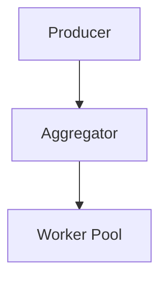

This is my folder for my project on Higgs Boson Analysis, utilising Docker for containerization and scalable deployment.

Use the following commands
# For Inital Run
docker compose build

docker compose down -v

docker compose up --build --scale worker=4

# To see the produced graph
wait for completion, then Ctrl+C

docker run --rm \
  -v simonhanaprojectv2_results_vol:/results \
  -v "$(pwd)/results":/out \
  alpine sh -c "cp -r /results/. /out/"

** System Architecture **

